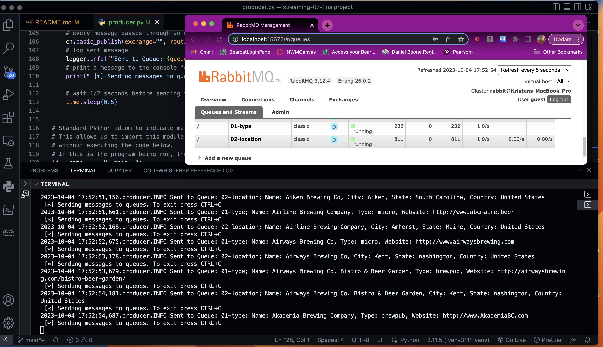
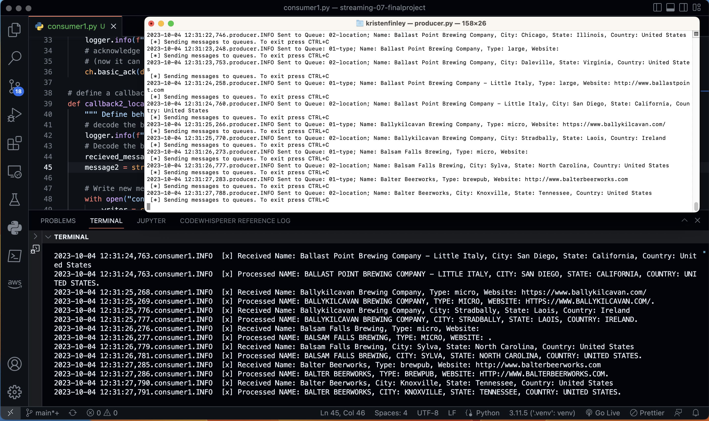
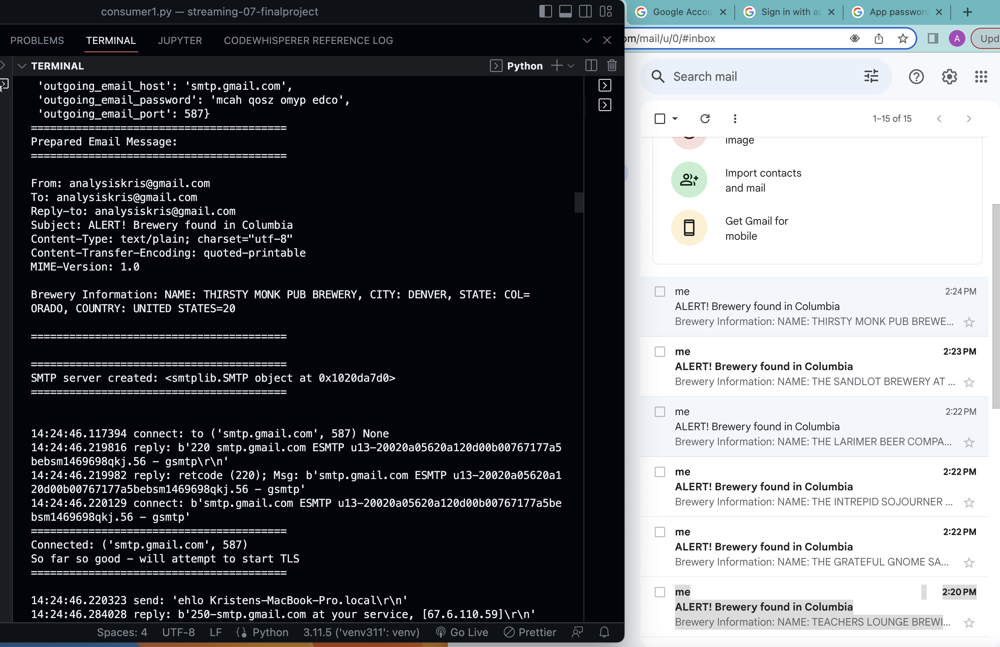

# streaming-07-finalproject

- Class: STREAMING DATA 44671-80/81FA23
- Assignment: P7-- Option 1
- Name: Kristen Finley
- Date: October 4, 2023

## Assignement Requirements
- Create a custom GitHub project repo to showcase your skills.
- Describe and plan an new implementation using RabbitMQ for streaming data. 
- Create one or more custom producers.
- Create one or more custom consumers.
- Simulate initial data source using Faker or some other file - or read from an API (not too much, too often, or too fast!)

## Assignment Questions
- How did you explore exchanges and queues?
    - For this assignment, I wrote one producer with two messages sent to two queues and one consumer. Unlike the consumer files written for previous modules, this consumber file processess two messages instead of one.
- Did you use time windows?
    - For this assignment, I did not use deques/time windows. The primary reason is that I felt comfortable using deques in the previous module and wanted to focus my time on mastering the use of email alerts; a skill I did not have time to master previously. Additionally, the data I found did not contain numerical values that would aid in the use of time windows.

---
# Breweries Streaming and Alerts
## Project Description

This project uses one producer to send two messages containg data from Open Brewery DB (a free dataset and API with public information on breweries, cideries, brewpubs, and bottleshops) to seperate queues via RabbitMQ. A consumer containing two callbacks was used to stream both messages.

The ultimate goal for this project will be to use the openbrewerydb API to request live data. For now, a csv file was used for data input.

### Messages:
- message1 = f"Name: {name}, Type: {brewery_type}, Website: {website_url}"
    -queue_name: "01-type"
- message2 = f"Name: {name}, City: {city}, State: {state_province}, Country: {country}"
    -queue_name: "02-location"

### Processing:
Each message was decoded to a string and converted to all caps. They were then written to seperate csv files.

### Alerts:
An alert was set up for message2 that sent an e-mail notification when messages contained breweries from Columbia, Missouri.

## Original Data
https://github.com/openbrewerydb/openbrewerydb/blob/master/breweries.csv

## Code Requirements
- Python 3.11+
- Virtual Environment using Python 3.11+
    * `python3 -m virutalenv venv311.`
    * `source venv311/bin/activate`
- Pika installed in your active environment
    * `python3 -m pip install pika`
- RabbitMQ server running locally

### Email Alerts Requirments
- Follow instructions in emailer.py uses:
    - smtplib - for transmission via smtp
    - email - handy EmailMessage class
    - tomllib - to read TOML files
    - try / except / finally to handle errors
    - .env.toml - to keep secrets (requires Python 3.11)
    - typehints - to help with code understanding
    - .env-example.toml as a template to enter the desired email address and password.
    https://github.com/denisecase/email-alert/blob/main/.env-example.toml

## Screenshots:

### RabbitMQ Queues sent by Producer

### Producer and Consumer Concurrently Ran
Concurrent messages, using multiple terminals

### Email Alerts

